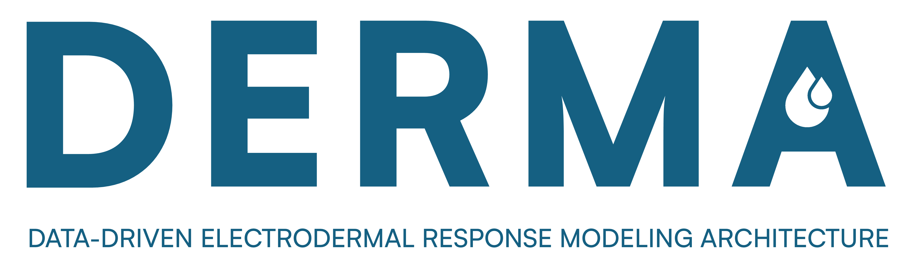

<p align="center">
  
</p>

# DERMA

**D**ata-driven **E**lectrodermal **R**esponse **M**odeling **A**rchitecture: synthetic
electrodermal activity (EDA) calibrated on real recordings.

DERMA estimates interpretable tonic and phasic parameters from real EDA recordings,
summarizes them as population profiles (maximum-likelihood fits with AIC model
selection), and generates synthetic signals with known ground truth: tonic and phasic
components, sudomotor driver and the coefficients of the SCR kernel. The model is
described in [docs/theory.md](docs/theory.md).

> **Status: early development.** The first releases port and generalize code developed
> during the author's PhD; the API is not stable yet.

## Contents

Available in v0.1:

- Synthetic EDA generation from literature ranges or from fitted profiles
  (`derma.generation`), with six reference profiles shipped with the package
  (`derma.profiles`)
- Parameter estimation and population profiles from decomposed recordings
  (`derma.estimation`), with an optional cvxEDA decomposition backend
  (`derma.decomposition`)
- Goodness-of-fit report for fitted profiles (`derma.report`)

In development (v0.2):

- Loaders for the CASE, MAUS and SAD datasets (`derma.datasets`)

## Installation

DERMA is not on PyPI yet. From a clone of this repository:

```bash
pip install -e .
pip install -e ".[cvxeda]"   # optional: cvxEDA decomposition backend
pip install -e ".[report]"   # optional: figures of the fit report (matplotlib)
```

## Datasets

DERMA never downloads or redistributes data. Download the original archive of a dataset
from its page and place it, unmodified, in a data folder; set `DERMA_DATA_DIR` to that
folder (or pass `data_dir=` to the functions). DERMA checks the archive SHA-256, reads it
and saves the prepared 4 Hz recordings in `prepared/` inside the same folder.

| Dataset | Archive | Page | License |
|---|---|---|---|
| CASE (Sharma et al., 2019) | `CASE_full.zip` | [figshare](https://springernature.figshare.com/articles/dataset/CASE_Dataset-full/8869157), doi:10.6084/m9.figshare.8869157 | CC0 1.0 |
| MAUS (Beh et al., 2021) | `MAUS.zip` | [IEEE DataPort](https://ieee-dataport.org/open-access/maus-dataset-mental-workload-assessment-n-back-task-using-wearable-sensor), doi:10.21227/q4td-yd35 | CC BY 4.0 |
| SAD (Healey and Picard, 2005) | `stress-recognition-in-automobile-drivers-1.0.0.zip` | [PhysioNet](https://physionet.org/content/drivedb/1.0.0/), doi:10.13026/C2SG6B | ODC-By 1.0 |

```bash
python -m derma.datasets status            # which archives are there, where to get the others
python -m derma.datasets prepare MAUS      # check, read and prepare one dataset
```

See [CONTRIBUTING.md](CONTRIBUTING.md) for the rules followed by the loaders.

## Example: from the archive to a profile

```python
from derma.datasets import maus
from derma.decomposition import decompose
from derma.estimation import RECIPES, estimate_profile, extract_segments
from derma.report import write_fit_report

maus.status()                      # is the archive there? where to download it
maus.prepare()                     # check SHA-256, read the archive, save 4 Hz recordings

recipe = RECIPES['MAUS_HighMWL']   # conditions, segment length, onset exclusion
segments = [[], [], [], []]        # raw, tonic, phasic, artifact
for rec in maus.load():
    if rec['labels'][0] not in recipe['conditions']:
        continue
    # Example cvxEDA parameters: choose them for your data
    tonic, phasic = decompose(rec['eda'], rec['fs'], alpha=8e-3, gamma=1e-1, delta_knot=10)
    parts = extract_segments(rec['eda'], tonic, phasic, rec['labels'], recipe, rec['fs'])
    for collection, part in zip(segments, parts):
        collection.extend(part)

profile, features = estimate_profile(*segments, fs=4)
write_fit_report(features, profile, 'report', 'MAUS_HighMWL')   # CSV, Markdown and PNG
```

## License

DERMA is released under the [MIT License](LICENSE).

The optional cvxEDA backend relies on the
[`cvxeda`](https://github.com/lciti/cvxEDA) package by L. Citi and A. Greco, which is
distributed under GPL-3.0 and is not included in DERMA. If you use it, please cite
Greco et al., "cvxEDA: a Convex Optimization Approach to Electrodermal Activity
Processing", *IEEE Trans. Biomed. Eng.*, 2016, doi:10.1109/TBME.2015.2474131.
